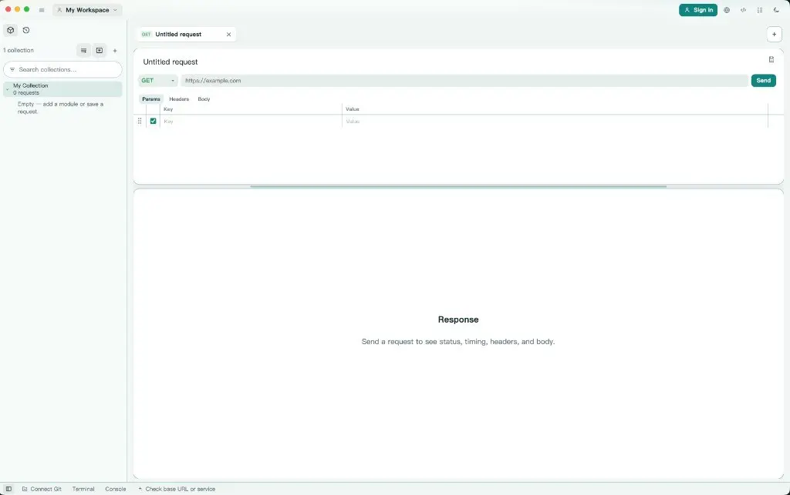
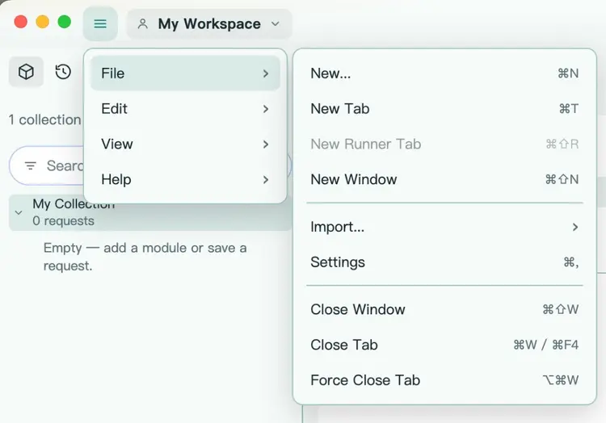
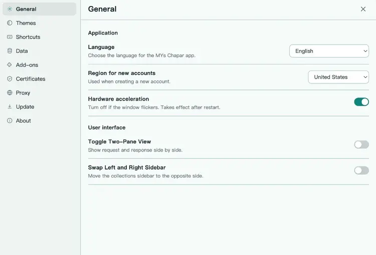
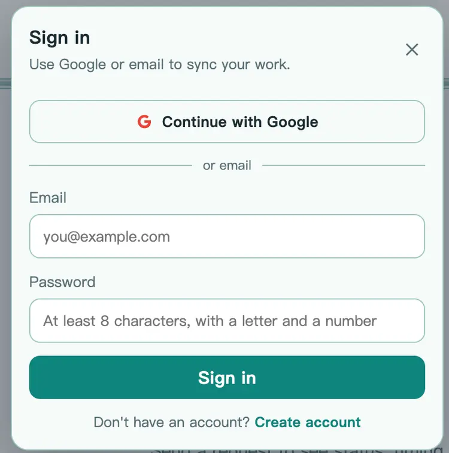
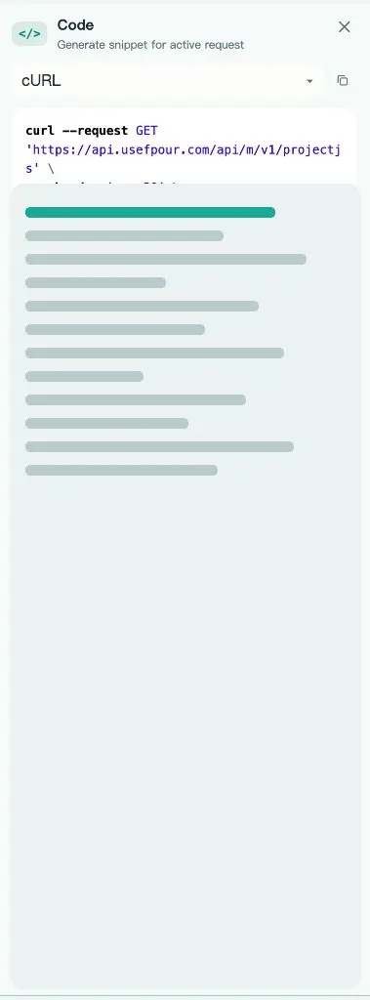

# راهنمای MYs Chapar

کلاینت HTTP برای ساخت، ذخیره و ارسال درخواست‌ها. اسکرین‌شات‌های زیر نمای دسکتاپ را نشان می‌دهند.

## فضای کار

بعد از باز شدن برنامه، مجموعهٔ پیش‌فرض در سمت چپ است و یک درخواست خالی در وسط.

1. متد را انتخاب کنید (مثلاً `GET`).
2. آدرس را وارد کنید.
3. در صورت نیاز **Params**، **Headers** یا **Body** را پر کنید.
4. **Send** را بزنید تا وضعیت، زمان، هدرها و بدنهٔ پاسخ پایین صفحه بیاید.

پایین پنجره **Connect Git**، **Terminal** و **Console** قرار دارند.

## منوی File

از آیکون سه‌خط بالا-چپ، **File** را باز کنید.

از اینجا می‌توانید تب یا پنجرهٔ جدید بسازید، ایمپورت کنید، به **Settings** بروید، یا تب را ببندید.

| دستور | میانبر مک |
| --- | --- |
| New… | ⌘N |
| New Tab | ⌘T |
| New Window | ⌘⇧N |
| Settings | ⌘, |
| Close Tab | ⌘W |

## تنظیمات عمومی

**File → Settings** را باز کنید و روی **General** بمانید.

- **Language** — زبان برنامه
- **Region for new accounts** — منطقهٔ حساب جدید
- **Hardware acceleration** — اگر پنجره چشمک می‌زند خاموش کنید؛ بعد از ری‌استارت اعمال می‌شود
- **Toggle Two-Pane View** — درخواست و پاسخ کنار هم
- **Swap Left and Right Sidebar** — جابه‌جایی سایدبار مجموعه‌ها

## ورود

برای همگام‌سازی کار، **Sign in** را بزنید.

با Google ادامه دهید، یا ایمیل و رمز بگذارید (حداقل ۸ کاراکتر، شامل حرف و عدد). اگر حساب ندارید، **Create account** را انتخاب کنید.

## کد درخواست (cURL)

برای کپی کردن درخواست فعال به‌صورت snippet، پنجرهٔ **Code** را باز کنید.

زبان را (مثلاً **cURL**) انتخاب کنید و با آیکون کپی، دستور را بردارید.
